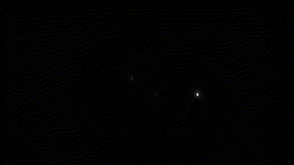

<div align="center">
  
</div>

<div align="center">

  <h3>🚀 Ready for Data Challenges | Optimized for Impact</h3>

  <p>
    <a href="https://techwithabhi.github.io/">
      
    </a>
    <a href="https://drive.google.com/file/d/120EP6tsKezaLIB9WZKcVAXCEKPNvJSUy/view?usp=sharing">
     
    </a>
  </p>

  <br />

</div>

## 👨‍💻 About Me

**Results-Driven Graduate specializing in Data Analysis, Visualization, and Modern Web Architectures.**

I specialize in **Data Analysis, Data Visualization, and Data Mining**, with a keen ability to apply forecasting and performance metrics for data-driven decision-making. I am committed to driving organizational success by implementing effective solutions in fast-paced environments, optimizing processes, and translating financial insights to enhance business efficiency.

* **📈 Efficiency Boost:** Proven track record of +45% optimization in previous projects.
* **🤖 AI Native:** Leveraging ChatGPT, Claude, Gemini, and DeepSeek for workflow automation and prompt engineering.
* **💡 Innovator:** Transforming data into stories that drive smarter decisions.

---

## ✨ Portfolio Highlights & Features

This portfolio is meticulously crafted to provide a seamless user experience, blending modern design aesthetics with robust technical architecture:

* **📱 Fully Responsive Design:** Fluid layouts built with modern CSS (Flexbox/Grid) ensuring flawless viewing across desktops, tablets, and mobile devices.
* **🎨 Dynamic Effects & Animations:** Smooth scrolling, hover transitions, and engaging entry animations that bring the UI to life without compromising performance.
* **🖼️ Optimized Assets & Icons:** Utilizing lightweight, scalable vector graphics (SVGs) and highly optimized imagery (like the custom profile UI) for lightning-fast load times.
* **🔗 Intuitive Navigation & Links:** A sticky, easy-to-navigate header allowing instant jumps to `ABOUT`, `SKILLS`, `PROJECTS`, and `CONTACT` sections, alongside secure, direct links to live data projects and downloadable resumes.
* **⚡ Accessible & Semantic HTML:** Clean, readable DOM structure ensuring high SEO rankings and accessibility for screen readers.

---

## 🛠️ Core Capabilities & Tech Stack

<div align="center">

### **Data Analysis & Intelligence**


### **Development & Web**


### **AI & Automation**


</div>

---

## 🧪 Featured Experiments & Projects

| Project | Description | Tech Stack |
| :--- | :--- | :--- |
| **Sales Performance Analysis** | In-depth market trend analysis using SQL and Power BI to identify high-growth revenue streams. | `SQL` `Power BI` `Python` |
| **Financial Forecasting** | Applying Python-based predictive modeling to forecast quarterly budget allocations with high accuracy. | `Python` `Pandas` `NumPy` |
| **Advanced Excel Dashboard** | Automated operational reporting system using Pivot Tables, Power Query, and VBA for efficiency. | `Excel` `VBA` `Power Query` |
| **React Timer & Stopwatch** | A fully responsive, interactive web application engineered with React for precise time tracking and lap management. | `React` `JavaScript` `CSS` |

---

## 📂 Project File Structure

```text
📦 techwithabhi.github.io
 ┣ 📂 assets
 ┃ ┣ 📂 icon
 ┃ ┃ ┗ 🖼️ dp2icon.png             # Profile imagery and favicons
 ┃ ┗ 📂 projects_data             # Detailed pages for case studies
 ┃   ┣ 📂 1st_pj_data
 ┃   ┃ ┣ 📄 1st_project.html
 ┃   ┃ ┗ 📂 images
 ┃   ┣ 📂 2nd_pj_data
 ┃   ┃ ┣ 📄 2nd_project.html
 ┃   ┃ ┗ 📂 images
 ┃   ┣ 📂 3rd_pj_data
 ┃   ┃ ┣ 📄 3rd_project.html
 ┃   ┃ ┗ 📂 images
 ┃   ┗ 📂 4th_pj_data
 ┃     ┣ 📄 4th_project.html      # React Timer & Stopwatch app
 ┃     ┗ 📂 images
 ┣ 📄 index.html                  # Main portfolio entry point
 ┣ 🎨 styles.css                  # Global stylesheet & responsive rules
 ┣ ⚡ script.js                   # DOM manipulation & animations
 ┗ 📝 README.md                   # Project documentation
```

## 🕹️ `PLAYER 1 : INITIALIZED`

> *"Code is my canvas. Data is my paint."*

<div align="center">
<table style="border-collapse: collapse; border: 2px solid #58A6FF;">
<tr>
<td align="center" width="500" bgcolor="#0D1117">
<br>

<br><br>

</td>
<td align="left" width="450" bgcolor="#0D1117" style="padding: 20px; color: #C9D1D9; font-family: monospace;">
<code><b>CLASS:</b> Full-Stack Data Mage</code><br><br>
<code><b>HP:</b>  ██████████████ 100%</code> <i>(Caffeine Levels)</i><br>
<code><b>MP:</b>  ██████████████ 100%</code> <i>(Creative Energy)</i><br><br>
<code><b>SPECIAL ABILITIES:</b></code><br>
🔮 <i>Predictive Modeling (Passive)</i><br>
⚡ <i>DOM Manipulation (Active)</i><br>
⚛️ <i>React Development (Active)</i><br>
🌌 <i>Pixel-Perfect UI (Ultimate)</i><br><br>
<code><b>CURRENT QUEST:</b></code><br>
<i>Building the future of web architecture while discovering hidden stories in complex datasets...</i>
</td>
</tr>
</table>
</div>
</div>

## 🤝 Let's Connect

Whether launching a new project or exploring fresh ideas, I'm here to turn your vision into reality.

<div align="center">
  <a href="https://github.com/techwithabhi">
    
  </a>
  <a href="https://www.linkedin.com/in/techwithabhi/">
    
  </a>
  <a href="mailto:abhisarkar6038@gmail.com">
    
  </a>
  <a href="https://x.com/AbhiSarkar2025">
    
  </a>
</div>

<br />

<div align="center">
  
  <br />
  <small>© 026 Abhi Sarkar || Data & Design || Optimized for Impact</small>
</div>